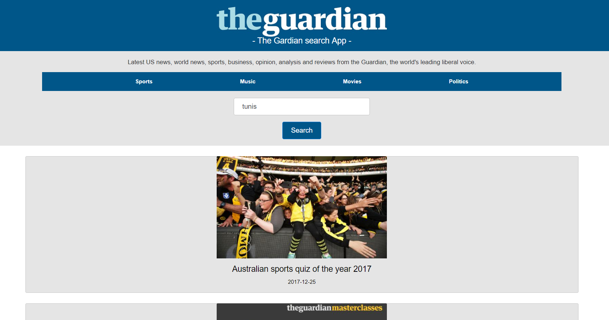

## The Gardian search App

  

Use The Guardian open API to create a news application (Search for keyword and list news).

## Project user stories :

1. User story: As a user I can search by keyword and get relative posts.

2. User story: As a user I can naviguate between different sections (Sports, Politics, Music ..) and get relative results.

3. User story: As a user I can see details about a post.

4. User story: As a user I can paginate between pages (each page should only displays 10 posts).

## What I used as technologies :

-  HTML + CSS + Bootstrap + React Js + Axios.